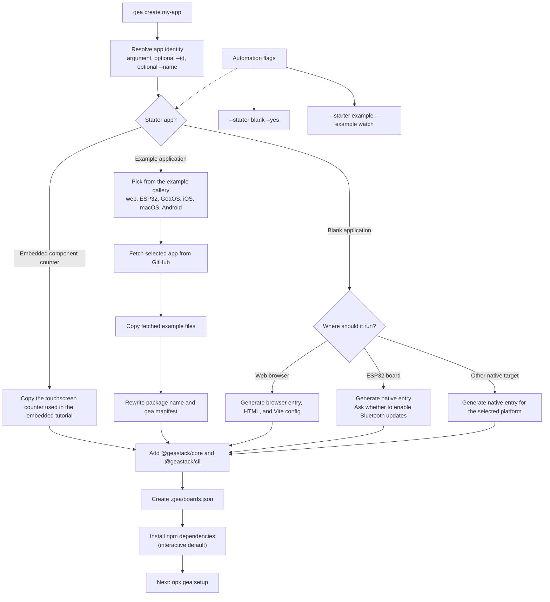
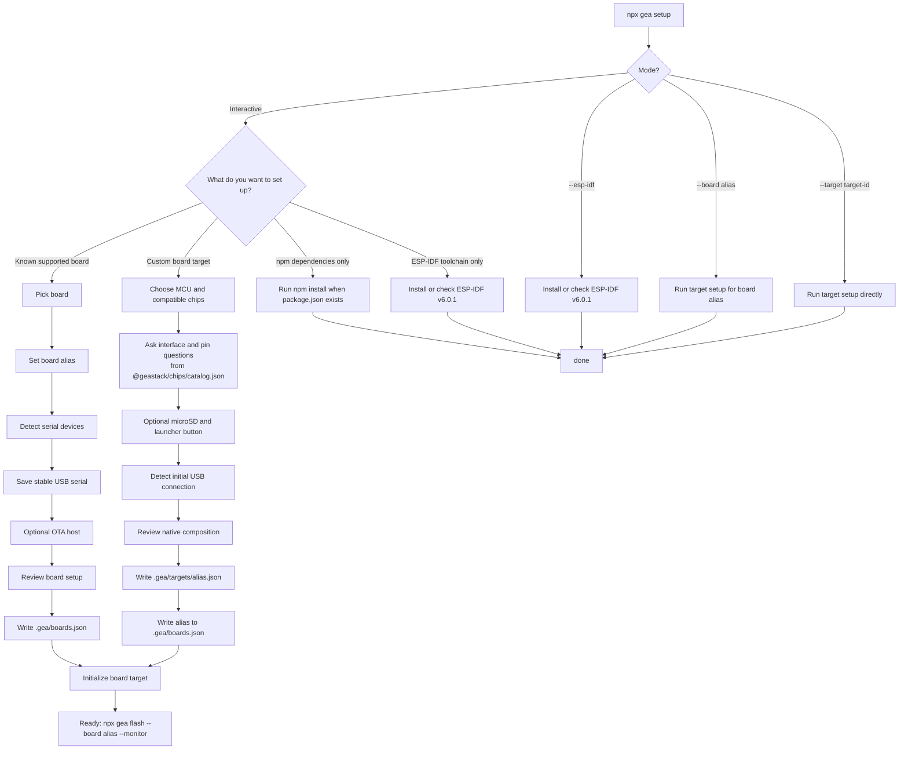

# @geastack/cli

Command-line front door for GeaStack.

This repo contains the `gea` CLI orchestrator and the `create-geastack`
scaffolder. The CLI turns GeaStack into an npm-first developer workflow while
keeping target-specific build logic behind stable backend contracts.

## Commands

```sh
npm install --global @geastack/cli
gea create my-panel
cd my-panel
gea doctor
gea setup
gea dev
gea build --target web
gea build --target ios
gea flash --board amoled --monitor
gea screenshot board.png --board amoled
gea monitor --board amoled
gea inspect --json
```

## Interactive Menu Map





The CLI resolves `@geastack/core`, `@geastack/targets`, the compiler, chips,
host bindings, and the other native packages from npm. A project can use a
local CLI with `npx gea` or a global installation with `gea`; neither command
depends on a GeaStack source checkout.

Boards are managed without editing JSON by hand; aliases live in
`~/.geastack/boards.json` (this machine) and the project's `.gea/boards.json`
(overrides):

```sh
gea boards discover                    # which registered board is on which USB port, its app and IP
gea boards list
gea boards set amoled host 192.168.1.100
gea boards rename amoled desk-amoled
gea boards remove desk-amoled
```

Custom boards remain editable after setup:

```sh
gea chips list
gea chips info co5300
gea chips add co5300 ft3168 --board my-board
gea chips remove ft3168 --board my-board
```

These commands update the app-local target definition. They do not copy native
sources into the application; the target adapter compiles the selected drivers
directly from the installed `@geastack/chips` package.

## Development

```sh
npm test
npm run check
```

Run from this repo during local development:

```sh
node bin/gea.mjs doctor
node bin/gea.mjs --help
node bin/create-geastack.mjs demo-panel --dir ./demo-panel --dry-run
```

## Machine Setup

Use [docs/SETUP.md](docs/SETUP.md) for Node/npm, ESP-IDF, Emscripten, Xcode,
Python, and board configuration. For the Waveshare ESP32-S3 AMOLED path, use
[docs/ESP32-WAVESHARE-AMOLED-QUICKSTART.md](docs/ESP32-WAVESHARE-AMOLED-QUICKSTART.md).
`npx gea doctor` checks the same dependencies and prints warnings for optional
target toolchains that are not installed.

[docs/NPX-COMMANDS.md](docs/NPX-COMMANDS.md) captures the private npmjs
`npx` command shape for release.

## Responsibilities

The CLI should own:

- command parsing and help output;
- project scaffolding;
- Gea app manifest validation;
- target discovery and target backend dispatch;
- consistent output, diagnostics, and exit codes;
- `doctor` checks for local toolchains, board config, and target backends.

The CLI should not own target implementation details. ESP32, GeaOS, Apple, and
web targets should keep their target-specific build logic in their own repos and
expose stable command contracts.

## Documentation

- [docs/SPEC.md](docs/SPEC.md): command surface, manifest expectations, and
  backend contract for the first implementation.

## Current Status

First implementation is in place:

- `doctor` for local toolchain checks;
- npm-resolved embedded board builds for ESP32 and RP2350;
- `flash`, `monitor`, WiFi OTA, and BLE OTA through `@geastack/targets`;
- `list` and `inspect` helpers;
- `create-geastack` with a bundled counter starter, a blank application, and a
  GitHub-backed rich example flow for web, embedded, GeaOS, iOS, macOS, and Android apps,
  all with `.gea/boards.json`, plus `gea boards` for machine-wide aliases in
  `~/.geastack/boards.json`.
