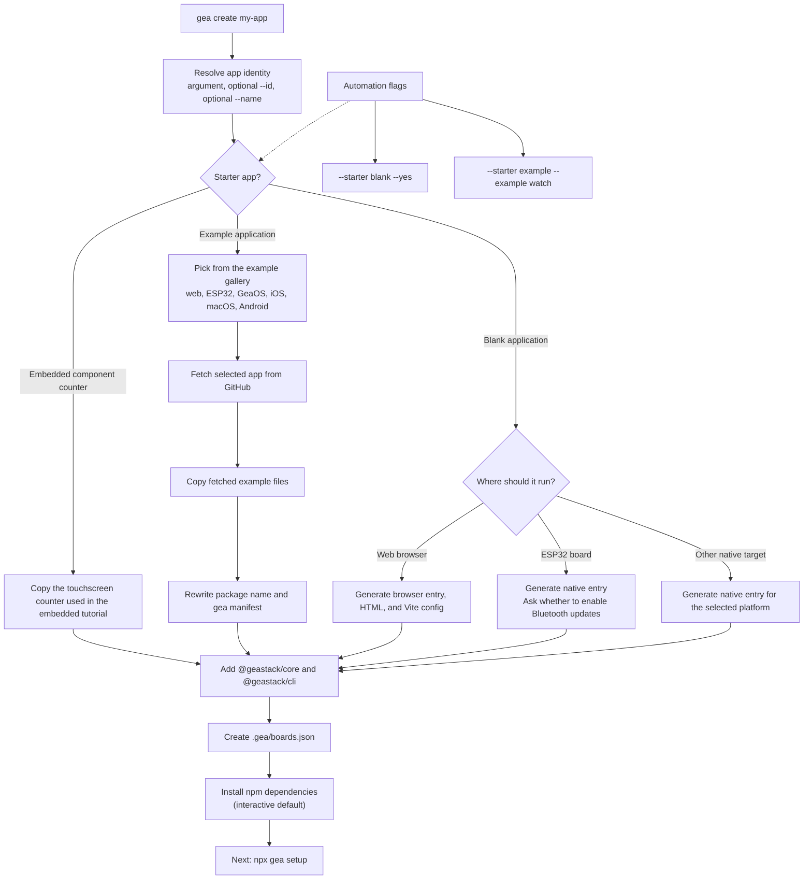
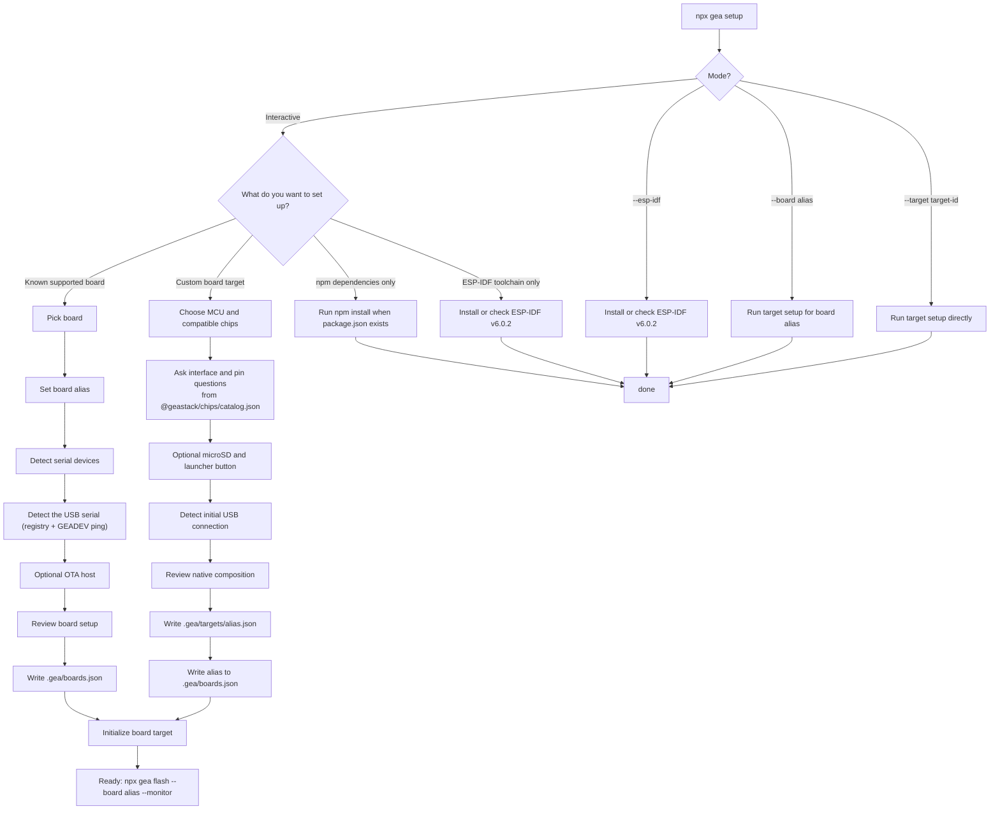

# @geastack/cli

Command-line front door for GeaStack.

This repo contains the `gea` CLI orchestrator and the `create-geastack`
scaffolder. The CLI turns GeaStack into an npm-first developer workflow while
keeping target-specific build logic behind stable backend contracts.

## Commands

```sh
npm install --global @geastack/cli
gea create my-panel
cd my-panel
gea doctor
gea setup
gea dev
gea build --target web
gea build --target ios
gea flash --board amoled --monitor
gea screenshot board.png --board amoled
gea monitor --board amoled
gea inspect --json
```

## Interactive Menu Map


```mermaid
flowchart TD
  create["gea create my-app"] --> identity["Resolve app identity<br/>argument, optional --id, optional --name"]
  identity --> starter{"Starter app?"}

  starter -->|"Embedded component counter"| counter["Copy the touchscreen counter used in the embedded tutorial"]

  starter -->|"Blank application"| emptyTarget{"Where should it run?"}
  emptyTarget -->|"Web browser"| emptyWeb["Generate browser entry, HTML, and Vite config"]
  emptyTarget -->|"ESP32 board"| emptyEsp["Generate native entry<br/>Ask whether to enable Bluetooth updates"]
  emptyTarget -->|"Other native target"| emptyNative["Generate native entry for the selected platform"]

  starter -->|"Example application"| pickExample["Pick from the example gallery<br/>web, ESP32, GeaOS, iOS, macOS, Android"]
  pickExample --> fetchExample["Fetch selected app from GitHub"]
  fetchExample --> copyExample["Copy fetched example files"]
  copyExample --> rewriteExample["Rewrite package name and gea manifest"]

  counter --> projectWiring["Add @geastack/core and @geastack/cli"]
  rewriteExample --> projectWiring["Add @geastack/core and @geastack/cli"]
  emptyWeb --> projectWiring
  emptyEsp --> projectWiring
  emptyNative --> projectWiring
  projectWiring --> boardConfig["Create .gea/boards.json"]
  boardConfig --> install["Install npm dependencies<br/>(interactive default)"]
  install --> setup["Next: npx gea setup"]

  auto["Automation flags"] -.-> starter
  auto --> autoEmpty["--starter blank --yes"]
  auto --> autoExample["--starter example --example watch"]
```


```mermaid
flowchart TD
  setup["npx gea setup"] --> mode{"Mode?"}

  mode -->|"--esp-idf"| directIdf["Install or check ESP-IDF v6.0.2"]
  mode -->|"--board alias"| directBoard["Run target setup for board alias"]
  mode -->|"--target target-id"| directTarget["Run target setup directly"]

  mode -->|"Interactive"| interactive{"What do you want to set up?"}

  interactive -->|"Known supported board"| knownBoard["Pick board"]
  knownBoard --> alias["Set board alias"]
  alias --> serial["Detect serial devices"]
  serial --> saveSerial["Detect the USB serial (registry + GEADEV ping)"]
  saveSerial --> ota["Optional OTA host"]
  ota --> reviewKnown["Review board setup"]
  reviewKnown --> writeKnown["Write .gea/boards.json"]

  interactive -->|"Custom board target"| custom["Choose MCU and compatible chips"]
  custom --> chipConfig["Ask interface and pin questions<br/>from @geastack/chips/catalog.json"]
  chipConfig --> features["Optional microSD and launcher button"]
  features --> connection["Detect initial USB connection"]
  connection --> reviewCustom["Review native composition"]
  reviewCustom --> writeProfile["Write .gea/targets/alias.json"]
  writeProfile --> writeCustomAlias["Write alias to .gea/boards.json"]

  interactive -->|"npm dependencies only"| npmInstall["Run npm install when package.json exists"]
  interactive -->|"ESP-IDF toolchain only"| idfOnly["Install or check ESP-IDF v6.0.2"]

  writeKnown --> initialize["Initialize board target"]
  writeCustomAlias --> initialize
  initialize --> ready["Ready: npx gea flash --board alias --monitor"]
  npmInstall --> done
  idfOnly --> done
  directIdf --> done
  directBoard --> done
  directTarget --> done
```

The CLI resolves `@geastack/core`, `@geastack/targets`, the compiler, chips,
host bindings, and the other native packages from npm. A project can use a
local CLI with `npx gea` or a global installation with `gea`; neither command
depends on a GeaStack source checkout.

Boards are managed without editing JSON by hand; aliases live in
`~/.geastack/boards.json` (this machine) and the project's `.gea/boards.json`
(overrides):

```sh
gea boards discover                    # which registered board is on which USB port, its app and IP
gea boards list
gea boards set amoled host 192.168.1.100
gea boards rename amoled desk-amoled
gea boards remove desk-amoled
```

Custom boards remain editable after setup:

```sh
gea chips list
gea chips info co5300
gea chips add co5300 ft3168 --board my-board
gea chips remove ft3168 --board my-board
```

These commands update the app-local target definition. They do not copy native
sources into the application; the target adapter compiles the selected drivers
directly from the installed `@geastack/chips` package.

## Wi-Fi updates for offline apps

An ESP32 app with no network API calls normally omits networking. Set
`gea.ota.wifi` to `true` in the app's `package.json` to retain Wi-Fi OTA and
remote diagnostics. Supply the usual `GEA_WIFI_SSID` and `GEA_WIFI_PASSWORD`
settings at build time. This declaration keeps networking available without
adding a network call to the app; it does not supply credentials.

## Development

```sh
npm test
npm run check
```

Run from this repo during local development:

```sh
node bin/gea.mjs doctor
node bin/gea.mjs --help
node bin/create-geastack.mjs demo-panel --dir ./demo-panel --dry-run
```

## Machine Setup

Use [docs/SETUP.md](docs/SETUP.md) for Node/npm, ESP-IDF, Emscripten, Xcode,
Python, and board configuration. For the Waveshare ESP32-S3 AMOLED path, use
[docs/ESP32-WAVESHARE-AMOLED-QUICKSTART.md](docs/ESP32-WAVESHARE-AMOLED-QUICKSTART.md).
`npx gea doctor` checks the same dependencies and prints warnings for optional
target toolchains that are not installed.

## Responsibilities

The CLI should own:

- command parsing and help output;
- project scaffolding;
- Gea app manifest validation;
- target discovery and target backend dispatch;
- consistent output, diagnostics, and exit codes;
- `doctor` checks for local toolchains, board config, and target backends.

The CLI should not own target implementation details. ESP32, GeaOS, Apple, and
web targets should keep their target-specific build logic in their own repos and
expose stable command contracts.

## Documentation

- [docs/PEBBLE-QUICKSTART.md](docs/PEBBLE-QUICKSTART.md): install the Pebble SDK,
  enable a TSX app, build a `.pbw`, and run on Pebble Time 2 or its emulator.

- [docs/SPEC.md](docs/SPEC.md): command surface, manifest expectations, and
  backend contract for the first implementation.
- [docs/SETUP.md](docs/SETUP.md): toolchains per target, the ESP-IDF version
  GeaStack resolves, and the board configuration files.
- [docs/DEVICE-CONTROL.md](docs/DEVICE-CONTROL.md): `gea devctl` in full, both
  wire protocols, and the display knobs.

## Current Status

First implementation is in place:

- `doctor` for local toolchain checks;
- npm-resolved embedded board builds for ESP32 and RP2350;
- `flash`, `monitor`, WiFi OTA, and BLE OTA through `@geastack/targets`;
- `list` and `inspect` helpers;
- `create-geastack` with a bundled counter starter, a blank application, and a
  GitHub-backed rich example flow for web, embedded, GeaOS, iOS, macOS, and Android apps,
  all with `.gea/boards.json`, plus `gea boards` for machine-wide aliases in
  `~/.geastack/boards.json`.

## License

Apache-2.0 (see `LICENSE`). You can ship closed-source products
built on it. The only GeaStack code under a different license is
the embedded board support (`targets` and `@geastack/chips`, GPL-3.0-only):
shipping closed-source firmware through those needs a commercial license.
Contact [contact@geastack.com](mailto:contact@geastack.com) for commercial terms, support and hosted builds.

## Browser development and emulation

`gea dev` (equivalently `gea dev --target web`) runs the Gea DOM/CSS app with
Vite HMR. `gea simulate` uses that same pipeline inside a device viewport and
opens the browser. Use `--no-open` to suppress opening, and `--width`, `--height`,
`--zoom`, and `--dpr` to configure the preview. DPR is a simulated Display API
value; it does not override the browser's pixel ratio.

The default for `simulate` changed from WASM to DOM. To retain the embedded
renderer and framebuffer workflow, use `gea simulate --renderer wasm`; this
explicit mode still requires Emscripten. Unknown renderer values are rejected.

`gea build --target web` emits HTML/JS/CSS into `.gea/build/web/site` (override
with `--out-dir`). The app's `index.html` is honored. Web-only Vite customization
belongs in `vite.web.config.ts`; new web apps scaffold this file. Existing
`vite.config.*` files remain dedicated to their previous build pipeline.

Compatible component edits and CSS changes update without reloading the page;
reactive state is preserved for compatible component edits. Incompatible edits
reload. Browser previews use simulated device APIs and browser layout; use the
WASM renderer or a physical device to validate embedded rendering.

Native compiler, UI, renderer, and display settings belong in the app manifest. See [Native build settings](docs/NATIVE-BUILD-CONFIG.md) for precedence, board overrides, and `gea config --board <alias>`.


## Chrome DevTools debugger

`gea run --debug --target macos` builds and launches a native Gea app with CDP
at `127.0.0.1:9222`, then opens Chrome DevTools. A declared macOS deployment
target is not required for debugging; the source manifest is unchanged. On Mac,
`gea run --debug` defaults to native for an app that already declares macOS.
`gea run --debug --target web` uses the existing DOM/CSS runtime with Vite HMR.

Elements inspects the native tree, authored class CSS, common inline/computed
styles, text, attributes and layout. Inline CSS and tree edits affect the actual
AppKit window. The Console runs JavaScriptCore scripts with `document`, `$0`,
selectors, style edits, element creation/removal and click dispatch wired to the
native tree. Compiled C++ app modules/stores are not console globals; source
breakpoints, arbitrary class stylesheet edits and promise awaiting are not yet
implemented. Runtime edits do not save to source and can be replaced by app code.

Use `--debug-port 9223` for CDP and `--port 5182` for the DOM server. Native
`--no-open` exposes CDP without opening Chrome. Ctrl-C or closing the owned app
or browser stops the session. Other native targets, WASM and
direct AppKit widget graphs outside the Gea retained tree remain unsupported.

The CLI installs `@geastack/debugger` automatically. Debugging requires Node.js
22 or later and Chrome/Chromium. Native builds need matching compiler and target
runtimes with debugger instrumentation; this release ships the host adapter and
CLI integration. `GEA_DEBUGGER_DIR` selects a development checkout;
contributor native launches use sibling Apple,
core/plugin packages and the shared compiler; explicit overrides win. Set
`GEA_CHROME_PATH` for a custom browser. Chrome uses its own app profile inside
`.gea/build/web`.


From your app directory, `gea run --debug --board amoled --debug-fps 10` builds and flashes debug
firmware on the registered AMOLED 2.06, then opens Chrome DevTools through USB.
Other ESP32 aliases use the same adapter. `--attach` connects to already-running
debug firmware without flashing; regular firmware is rejected before JTAG or
Chrome starts. `--no-open` exposes only the CDP endpoint.
`--port` selects the USB device when using `--board`, while `--debug-port` selects
CDP. The debugger owns the serial stream; stop it before using `gea devctl` or
`gea monitor` on that port.

Device builds retain engine CSS features and authored rules for runtime edits.
The board contains no JavaScript VM. Its Console evaluates JavaScript on the
host against a snapshot; supported mutations are acknowledged by the device
before evaluation returns. A following evaluation reads fresh device state.
Use an async function and `await document.createElement(...)` to create nodes.
On ESP32-S3, add `--debug-sources` to explicitly start USB JTAG for original
TypeScript source maps, line/column hardware breakpoints and Step Over/Into/Out. Scope
shows native C++ locals; paused-frame evaluation accepts GDB C++ expressions.
The board has two breakpoint slots. Its matching ELF is verified before attach;
older firmware needs a fresh build. Tree/style inspection does not start JTAG
by default. `GEA_DEBUGGER_JTAG=1` also opts in; `--no-debug-sources` overrides it.
Native Mac source stepping is not implemented yet. Inline
styles, authored class rules, attributes, text, append/remove and compiled event clicks affect the
actual device. Live changes are sampled every 750 ms. See the debugger README
for supported properties, USB bounds, and example scripts.

Add `--debug-fps 30` (or `--debug-fps 10`) to a board debug launch to reserve
more time for inspection and editing. Values are integers from 1 to 120. Debug
firmware enforces the cap across timer, TE and input/catch-up frame paths; app
FPS settings cannot exceed it. Use `--attach --debug-fps 10` to change the cap
on current debug firmware without rebuilding/flashing. Omitting the flag leaves
an existing attached app's cap alone; a fresh build defaults to normal pacing.
The cap persists after disconnecting. Firmware from before snapshot integrity
and FPS control support needs one rebuild.
